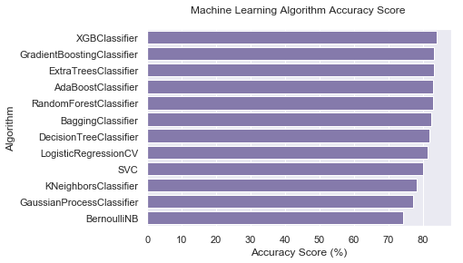

# Titanic Survival Analytics - Report
***

RMS Titanic was a British passenger liner that sank in the North Atlantic Ocean in the early hours of 15 April 1912, after colliding with an iceberg during its maiden voyage from Southampton to New York City. There were an estimated 2,224 passengers and crew aboard, and more than 1,500 died, making it one of the deadliest commercial peacetime maritime disasters in modern history. This sensational tragedy shocked the international community and led to better safety regulations for ships.
<br><br>
One of the reasons that the shipwreck led to such loss of life was that there were not enough lifeboats for the passengers and crew. Although there was some element of luck involved in surviving the sinking, some groups of people were more likely to survive than others, such as women, children, and the upper-class.
<br><br>
This notebook is an analysis on what sorts of people were likely to survive. In partciular, I build a Machine Learning model to predict which passengers survived the tragedy.


## Table Of Contents
***
### Objective
- [Goal of the notebook](#datacleaning2)

### Data Quality Check
- [Simple Inspection of Data](#datacleaning)

### Data Preprocessing
- [Missing Values](#missingValues)
- [Imputation](#imputation)
- [Feature Engineering](#newFeatures)

### Descriptive Statistics
- [Univariate Analysis](#univariateAnalysis)
- [Bivariate Values](#bivariateAnalysis)
- [Multivariate Values](#multivariateAnalysis)
- [Pearson Correlation](#pearsonCorr)

### Modelling
- [Decision Tree](#decisionTree)
- [Adaboost Classifier](#adaboost)
- [Bagging Classifier](#bagging)
- [Extra Trees Classifier](#extraTrees)
- [Gradient Boosting Classifier](#gradientBoost)
- [Random Forest Classifier](#randomForest)
- [Gaussian Process Classifier](#gaussianProcess)
- [Logistic Regression](#logisticRegression)
- [Bernoulli NB](#bernoulliNB)
- [K Neighbours Classifier](#kNeighbours)
- [SVC](#svc)
- [XGB Classifier](#xgb)
- [Comparing the ML Models](#comparison)

### Voting Classifiers
- [Hard Voting Classifier](#hardVote)
- [Soft Voting Classifier](#softVote)
- [Save Models to File](#saveModels)

### Submission

### Conclusion

<a id='datacleaning2'></a>
# Objective
***

- To understand what sorts of people were likely to survive the tragedy.
- Build a Machine Learning model that can predict which passengers survived the tragedy.

# Import Packages
***


```python
import pandas as pd
import numpy as np
import seaborn as sns
import matplotlib.pyplot as plt
from scipy import stats
from scipy.stats import norm, skew 
import re

pd.options.display.max_rows = 1000
pd.options.display.max_columns = 100

%matplotlib inline

import warnings
warnings.filterwarnings('ignore')
```

# Read the data
***


```python
train = pd.read_csv('../input/train.csv')
test = pd.read_csv('../input/test.csv')
```

<a id='datacleaning'></a>
# Data Quality Check
***


```python
# Examine the train dataset
train.head()
```


<div>
<style scoped>
    .dataframe tbody tr th:only-of-type {
        vertical-align: middle;
    }

    .dataframe tbody tr th {
        vertical-align: top;
    }

    .dataframe thead th {
        text-align: right;
    }
</style>
<table border="1" class="dataframe">
  <thead>
    <tr style="text-align: right;">
      <th></th>
      <th>PassengerId</th>
      <th>Survived</th>
      <th>Pclass</th>
      <th>Name</th>
      <th>Sex</th>
      <th>Age</th>
      <th>SibSp</th>
      <th>Parch</th>
      <th>Ticket</th>
      <th>Fare</th>
      <th>Cabin</th>
      <th>Embarked</th>
    </tr>
  </thead>
  <tbody>
    <tr>
      <th>0</th>
      <td>1</td>
      <td>0</td>
      <td>3</td>
      <td>Braund, Mr. Owen Harris</td>
      <td>male</td>
      <td>22.0</td>
      <td>1</td>
      <td>0</td>
      <td>A/5 21171</td>
      <td>7.2500</td>
      <td>NaN</td>
      <td>S</td>
    </tr>
    <tr>
      <th>1</th>
      <td>2</td>
      <td>1</td>
      <td>1</td>
      <td>Cumings, Mrs. John Bradley (Florence Briggs Th...</td>
      <td>female</td>
      <td>38.0</td>
      <td>1</td>
      <td>0</td>
      <td>PC 17599</td>
      <td>71.2833</td>
      <td>C85</td>
      <td>C</td>
    </tr>
    <tr>
      <th>2</th>
      <td>3</td>
      <td>1</td>
      <td>3</td>
      <td>Heikkinen, Miss. Laina</td>
      <td>female</td>
      <td>26.0</td>
      <td>0</td>
      <td>0</td>
      <td>STON/O2. 3101282</td>
      <td>7.9250</td>
      <td>NaN</td>
      <td>S</td>
    </tr>
    <tr>
      <th>3</th>
      <td>4</td>
      <td>1</td>
      <td>1</td>
      <td>Futrelle, Mrs. Jacques Heath (Lily May Peel)</td>
      <td>female</td>
      <td>35.0</td>
      <td>1</td>
      <td>0</td>
      <td>113803</td>
      <td>53.1000</td>
      <td>C123</td>
      <td>S</td>
    </tr>
    <tr>
      <th>4</th>
      <td>5</td>
      <td>0</td>
      <td>3</td>
      <td>Allen, Mr. William Henry</td>
      <td>male</td>
      <td>35.0</td>
      <td>0</td>
      <td>0</td>
      <td>373450</td>
      <td>8.0500</td>
      <td>NaN</td>
      <td>S</td>
    </tr>
  </tbody>
</table>
</div>


```python
# Examine the test dataset
test.head()
```


<div>
<style scoped>
    .dataframe tbody tr th:only-of-type {
        vertical-align: middle;
    }

    .dataframe tbody tr th {
        vertical-align: top;
    }

    .dataframe thead th {
        text-align: right;
    }
</style>
<table border="1" class="dataframe">
  <thead>
    <tr style="text-align: right;">
      <th></th>
      <th>PassengerId</th>
      <th>Pclass</th>
      <th>Name</th>
      <th>Sex</th>
      <th>Age</th>
      <th>SibSp</th>
      <th>Parch</th>
      <th>Ticket</th>
      <th>Fare</th>
      <th>Cabin</th>
      <th>Embarked</th>
    </tr>
  </thead>
  <tbody>
    <tr>
      <th>0</th>
      <td>892</td>
      <td>3</td>
      <td>Kelly, Mr. James</td>
      <td>male</td>
      <td>34.5</td>
      <td>0</td>
      <td>0</td>
      <td>330911</td>
      <td>7.8292</td>
      <td>NaN</td>
      <td>Q</td>
    </tr>
    <tr>
      <th>1</th>
      <td>893</td>
      <td>3</td>
      <td>Wilkes, Mrs. James (Ellen Needs)</td>
      <td>female</td>
      <td>47.0</td>
      <td>1</td>
      <td>0</td>
      <td>363272</td>
      <td>7.0000</td>
      <td>NaN</td>
      <td>S</td>
    </tr>
    <tr>
      <th>2</th>
      <td>894</td>
      <td>2</td>
      <td>Myles, Mr. Thomas Francis</td>
      <td>male</td>
      <td>62.0</td>
      <td>0</td>
      <td>0</td>
      <td>240276</td>
      <td>9.6875</td>
      <td>NaN</td>
      <td>Q</td>
    </tr>
    <tr>
      <th>3</th>
      <td>895</td>
      <td>3</td>
      <td>Wirz, Mr. Albert</td>
      <td>male</td>
      <td>27.0</td>
      <td>0</td>
      <td>0</td>
      <td>315154</td>
      <td>8.6625</td>
      <td>NaN</td>
      <td>S</td>
    </tr>
    <tr>
      <th>4</th>
      <td>896</td>
      <td>3</td>
      <td>Hirvonen, Mrs. Alexander (Helga E Lindqvist)</td>
      <td>female</td>
      <td>22.0</td>
      <td>1</td>
      <td>1</td>
      <td>3101298</td>
      <td>12.2875</td>
      <td>NaN</td>
      <td>S</td>
    </tr>
  </tbody>
</table>
</div>


```python
# Check the type of our features. Are there any data inconsistencies?
train.dtypes
```


    PassengerId      int64
    Survived         int64
    Pclass           int64
    Name            object
    Sex             object
    Age            float64
    SibSp            int64
    Parch            int64
    Ticket          object
    Fare           float64
    Cabin           object
    Embarked        object
    dtype: object


```python
# Can you check to see if there are any missing values in our data set
train.isnull().any()
```


    PassengerId    False
    Survived       False
    Pclass         False
    Name           False
    Sex            False
    Age             True
    SibSp          False
    Parch          False
    Ticket         False
    Fare           False
    Cabin           True
    Embarked        True
    dtype: bool


```python
# What is the size of the training set?
train.shape
```


    (891, 12)


```python
# What is the size of the test set?
test.shape
```


    (418, 11)


```python
# concatenating the data
all_data = pd.concat((train.drop(['PassengerId', 'Survived'], axis = 1),
                      test.drop(['PassengerId'], axis = 1))).reset_index(drop=True)

# Function to split back train and test set from "all_data"
def updateTrainTestData():
    global train
    global test
    global all_data
    ntrain = train.shape[0]
    ntest = test.shape[0]

    train_id = train['PassengerId']
    test_id = test['PassengerId']
    label = train['Survived']

    train = all_data[:ntrain]
    train['Survived'] = label
    train['PassengerId'] = train_id
    test = all_data[ntrain:].reset_index().drop(['index'], axis = 1)
    test['PassengerId'] = test_id
    
```

# Data Preprocessing
***


<a id = '#missingValues'></a>
## Missing Values
***


```python
missing_total = all_data.isnull().sum().sort_values(ascending=False)
missing_total
```


    Cabin       1014
    Age          263
    Embarked       2
    Fare           1
    Ticket         0
    Parch          0
    SibSp          0
    Sex            0
    Name           0
    Pclass         0
    dtype: int64


```python
percent = (all_data.isnull().sum() * 100/all_data.isnull().count()).sort_values(ascending=False)
missing_data = pd.concat([missing_total, percent], axis=1, keys=['Total', 'Percent'])
missing_data[missing_data['Percent'] > 0]['Percent'].plot.bar(by = 'Percent', figsize=(6,4))
```


    <matplotlib.axes._subplots.AxesSubplot at 0x1a2b5e8278>


<a id = '#imputation'></a>
## Imputation
***

The large number of missing values in "Cabin" supposedly imply that those passengers didn't have any cabin.


```python
# imputing "Cabin" with "None"
all_data['Cabin'] = all_data['Cabin'].fillna("None")
```

We have plenty of missing values in "Age". Lets generate random numbers between (mean - std) and (mean + std) and fill them.


```python
# imputing "Age" with random number between (mean - std) and (mean + std) 
age_avg = all_data['Age'].mean()
age_std = all_data['Age'].std()
age_null_count = all_data['Age'].isnull().sum()

age_null_random_list = np.random.randint(age_avg - age_std, age_avg + age_std, size=age_null_count)
all_data['Age'].loc[all_data['Age'].isnull()] = age_null_random_list
```


```python
# imputing "Embarked" with 'S'
all_data['Embarked'] = all_data['Embarked'].fillna('S')
```


```python
# Displaying row with missing "Fare" value
all_data.loc[all_data['Fare'].isnull()]
```


<div>
<style scoped>
    .dataframe tbody tr th:only-of-type {
        vertical-align: middle;
    }

    .dataframe tbody tr th {
        vertical-align: top;
    }

    .dataframe thead th {
        text-align: right;
    }
</style>
<table border="1" class="dataframe">
  <thead>
    <tr style="text-align: right;">
      <th></th>
      <th>Pclass</th>
      <th>Name</th>
      <th>Sex</th>
      <th>Age</th>
      <th>SibSp</th>
      <th>Parch</th>
      <th>Ticket</th>
      <th>Fare</th>
      <th>Cabin</th>
      <th>Embarked</th>
    </tr>
  </thead>
  <tbody>
    <tr>
      <th>1043</th>
      <td>3</td>
      <td>Storey, Mr. Thomas</td>
      <td>male</td>
      <td>60.5</td>
      <td>0</td>
      <td>0</td>
      <td>3701</td>
      <td>NaN</td>
      <td>None</td>
      <td>S</td>
    </tr>
  </tbody>
</table>
</div>


Let us find most frequent "Fare" for male passengers of Pclass "3", who embarked on "S" and use the value to replace the missing "Fare" value.


```python
# Imputing 'Fare' with most frequent value of the passengers who has same Pclass, Sex, and Embarked
fare_val = all_data[(all_data['Sex'] == 'male') & 
                    (all_data['Pclass'] == 3) & (all_data['Embarked'] == 'S')]['Fare'].mode()

all_data['Fare'].fillna(fare_val[0], inplace = True)
```

<a id = 'newFeatures'></a>
## Feature Engineering
***


```python
# Family Size
all_data['FamilySize'] = all_data['SibSp'] + all_data['Parch'] + 1

# Is alone
all_data.loc[all_data['FamilySize'] == 1, 'IsAlone'] = '1'
all_data.loc[all_data['FamilySize'] > 1, 'IsAlone'] = '0'

# Define function to extract titles from passenger names
def get_title(name):
    title_search = re.search(' ([A-Za-z]+)\.', name)
    # If the title exists, extract and return it.
    if title_search:
        return title_search.group(1)
    return ""

# Title
all_data['Title'] = all_data['Name'].apply(get_title)
all_data['Title'] = all_data['Title'].replace(['Lady', 'Countess',
                                             'Capt', 'Col','Don', 
                                             'Dr', 'Major', 'Rev', 
                                             'Sir', 'Jonkheer', 'Dona'], 'Rare')

all_data['Title'] = all_data['Title'].replace('Mlle', 'Miss')
all_data['Title'] = all_data['Title'].replace('Ms', 'Miss')
all_data['Title'] = all_data['Title'].replace('Mme', 'Mrs')

# Last name
all_data['LastName'] = all_data['Name'].str.partition(',')[0]

# Kids upto 5 years old are most likely to survive
all_data['IsBaby'] = all_data['Age'].apply(lambda x: 1 if x < 6 else 0)

# Let's find their mother. Cause kids won't be sent alone for rescue
babyLastName = list(np.unique(all_data[all_data['IsBaby'] == 1][['LastName']].values))

def isMother(x):
    if ((x['Age'] > 15) & (x['Sex'] == 'female') 
        & (x['LastName'] in babyLastName) & (x['Parch'] != 0)):
        return 1
    else:
        return 0

all_data['IsMother'] = all_data[['Age', 'Sex', 'LastName', 'Parch']].apply(isMother, axis=1)

# Let us make a new feature for unseparable duo - mother and baby
all_data['IsMotherBabyDuo'] = all_data['IsBaby'] | all_data['IsMother']

# Type Cast
all_data['IsMotherBabyDuo'] = all_data['IsMotherBabyDuo'].astype('object')
all_data['IsMother'] = all_data['IsMother'].astype('object')
all_data['IsBaby'] = all_data['IsBaby'].astype('object')

# Bucketize Age
all_data.loc[ all_data['Age'] <= 16, 'AgeBucket'] = '0'
all_data.loc[(all_data['Age'] > 16) & (all_data['Age'] <= 32), 'AgeBucket'] = '1'
all_data.loc[(all_data['Age'] > 32) & (all_data['Age'] <= 48), 'AgeBucket'] = '2'
all_data.loc[(all_data['Age'] > 48) & (all_data['Age'] <= 64), 'AgeBucket'] = '3'
all_data.loc[ all_data['Age'] > 64, 'AgeBucket'] = '4'
    
# Bucketize Fare
all_data.loc[ all_data['Fare'] <= 7.91, 'FareBucket'] = '0'
all_data.loc[(all_data['Fare'] > 7.91) & (all_data['Fare'] <= 14.454), 'FareBucket'] = '1'
all_data.loc[(all_data['Fare'] > 14.454) & (all_data['Fare'] <= 31), 'FareBucket'] = '2'
all_data.loc[ all_data['Fare'] > 31, 'FareBucket'] = '3'

# Has Cabin
all_data.loc[(all_data['Cabin'] == 'None', 'HasCabin')] = '0'
all_data['HasCabin'].fillna('1', inplace = True)

# Age*Class
all_data['Age*Class'] = (all_data.Age * all_data.Pclass).astype('float')

# Pclass
all_data['Pclass'] = all_data['Pclass'].astype('object')
```


```python
# Function to do label encoding of categorical attributes
def encoding():
    # Mapping titles
    title_mapping = {"Mr": 1, "Miss": 2, "Mrs": 3, "Master": 4, "Rare": 5}
    all_data['Title'] = all_data['Title'].map(title_mapping).astype(int)
    all_data['Title'] = all_data['Title'].fillna(0)
    
    # Mapping Embarked
    all_data['Embarked'] = all_data['Embarked'].map( {'S': 0, 'C': 1, 'Q': 2} ).astype(int)
    
    # Mapping Sex
    all_data['Sex'] = all_data['Sex'].map( {'female': 0, 'male': 1} ).astype(int)
    
# Function to typecast features in appropriate data types
def typeCast():
    all_data['Pclass'] = all_data['Pclass'].astype('int')
    all_data['AgeBucket'] = all_data['AgeBucket'].astype(int)
    all_data['FareBucket'] = all_data['FareBucket'].astype(int)
    all_data['IsAlone'] = all_data['IsAlone'].astype(int)
    all_data['HasCabin'] = all_data['HasCabin'].astype(int)
    all_data['IsMotherBabyDuo'] = all_data['IsMotherBabyDuo'].astype('int')
```

***


```python
# Update train and test sets    
updateTrainTestData()
```

# Exploratory Data Analysis
***


```python
# Feature Selection
features = ['Pclass', 'Sex', 'SibSp', 'Parch','Embarked', 'FamilySize', 'IsAlone', 'Title',
       'IsMotherBabyDuo', 'AgeBucket', 'FareBucket','HasCabin', 'Age*Class', 'Survived']

# numeric data
quantitative = ['Age', 'Fare', 'FamilySize', 'Age*Class']

# categorical data
qualitative = ['Pclass', 'Sex', 'SibSp', 'Parch', 'HasCabin', 'Embarked', 
               'IsAlone', 'Title', 'IsBaby', 'IsMother', 'IsMotherBabyDuo', 'AgeBucket', 'FareBucket']
```

***


```python
# Display the statistical overview of the numerical attributes of the dataset
all_data.describe()
```


<div>
<style scoped>
    .dataframe tbody tr th:only-of-type {
        vertical-align: middle;
    }

    .dataframe tbody tr th {
        vertical-align: top;
    }

    .dataframe thead th {
        text-align: right;
    }
</style>
<table border="1" class="dataframe">
  <thead>
    <tr style="text-align: right;">
      <th></th>
      <th>Age</th>
      <th>SibSp</th>
      <th>Parch</th>
      <th>Fare</th>
      <th>FamilySize</th>
      <th>Age*Class</th>
    </tr>
  </thead>
  <tbody>
    <tr>
      <th>count</th>
      <td>1309.000000</td>
      <td>1309.000000</td>
      <td>1309.000000</td>
      <td>1309.000000</td>
      <td>1309.000000</td>
      <td>1309.00000</td>
    </tr>
    <tr>
      <th>mean</th>
      <td>29.679656</td>
      <td>0.498854</td>
      <td>0.385027</td>
      <td>33.276193</td>
      <td>1.883881</td>
      <td>64.06793</td>
    </tr>
    <tr>
      <th>std</th>
      <td>13.351944</td>
      <td>1.041658</td>
      <td>0.865560</td>
      <td>51.743584</td>
      <td>1.583639</td>
      <td>32.79117</td>
    </tr>
    <tr>
      <th>min</th>
      <td>0.170000</td>
      <td>0.000000</td>
      <td>0.000000</td>
      <td>0.000000</td>
      <td>1.000000</td>
      <td>0.51000</td>
    </tr>
    <tr>
      <th>25%</th>
      <td>21.000000</td>
      <td>0.000000</td>
      <td>0.000000</td>
      <td>7.895800</td>
      <td>1.000000</td>
      <td>42.00000</td>
    </tr>
    <tr>
      <th>50%</th>
      <td>28.000000</td>
      <td>0.000000</td>
      <td>0.000000</td>
      <td>14.454200</td>
      <td>1.000000</td>
      <td>60.00000</td>
    </tr>
    <tr>
      <th>75%</th>
      <td>37.000000</td>
      <td>1.000000</td>
      <td>0.000000</td>
      <td>31.275000</td>
      <td>2.000000</td>
      <td>84.00000</td>
    </tr>
    <tr>
      <th>max</th>
      <td>80.000000</td>
      <td>8.000000</td>
      <td>9.000000</td>
      <td>512.329200</td>
      <td>11.000000</td>
      <td>222.00000</td>
    </tr>
  </tbody>
</table>
</div>


<b>Observation</b>
- Feature "Pclass" is a nominal data.
- The minimum value of "SibSp" and "Parch" are 0. That implies there are few passengers who are travelling alone. That's how we created "IsAlone" feature in previous section.
- I realised that there are only 4 people on board who paid a "Fare" of 512. Must be VVIP. 
- The second highest "Fare" price is 263 (which is held by 7 passengers), while the third highest "Fare" price is 262.3750 (which is again held by 7 passengers). Need to analyse if there is any significance of the 0.625 difference in their prices.
- The max value of "Parch" is set to 9 which is held by two passengers exactly. Similarly, the second highest value of "Parch" is set to 6, which is again held by two passengers. Suposedly, they are two couples.
- Feature "Age" has 12 values which lie between 0 to 1 (e.g., 0.17, 0.33, 0.42, etc). On reading "Data description", I figured out that the age of passengers below 1 year old has been specified in fractions.


```python
# Display the statistical overview of the categorical attributes of the dataset
all_data.describe(include = ['object'])
```


<div>
<style scoped>
    .dataframe tbody tr th:only-of-type {
        vertical-align: middle;
    }

    .dataframe tbody tr th {
        vertical-align: top;
    }

    .dataframe thead th {
        text-align: right;
    }
</style>
<table border="1" class="dataframe">
  <thead>
    <tr style="text-align: right;">
      <th></th>
      <th>Pclass</th>
      <th>Name</th>
      <th>Sex</th>
      <th>Ticket</th>
      <th>Cabin</th>
      <th>Embarked</th>
      <th>IsAlone</th>
      <th>Title</th>
      <th>LastName</th>
      <th>IsBaby</th>
      <th>IsMother</th>
      <th>IsMotherBabyDuo</th>
      <th>AgeBucket</th>
      <th>FareBucket</th>
      <th>HasCabin</th>
    </tr>
  </thead>
  <tbody>
    <tr>
      <th>count</th>
      <td>1309</td>
      <td>1309</td>
      <td>1309</td>
      <td>1309</td>
      <td>1309</td>
      <td>1309</td>
      <td>1309</td>
      <td>1309</td>
      <td>1309</td>
      <td>1309</td>
      <td>1309</td>
      <td>1309</td>
      <td>1309</td>
      <td>1309</td>
      <td>1309</td>
    </tr>
    <tr>
      <th>unique</th>
      <td>3</td>
      <td>1307</td>
      <td>2</td>
      <td>929</td>
      <td>187</td>
      <td>3</td>
      <td>2</td>
      <td>5</td>
      <td>875</td>
      <td>2</td>
      <td>2</td>
      <td>2</td>
      <td>5</td>
      <td>4</td>
      <td>2</td>
    </tr>
    <tr>
      <th>top</th>
      <td>3</td>
      <td>Kelly, Mr. James</td>
      <td>male</td>
      <td>CA. 2343</td>
      <td>None</td>
      <td>S</td>
      <td>1</td>
      <td>Mr</td>
      <td>Andersson</td>
      <td>0</td>
      <td>0</td>
      <td>0</td>
      <td>1</td>
      <td>0</td>
      <td>0</td>
    </tr>
    <tr>
      <th>freq</th>
      <td>709</td>
      <td>2</td>
      <td>843</td>
      <td>11</td>
      <td>1014</td>
      <td>916</td>
      <td>790</td>
      <td>757</td>
      <td>11</td>
      <td>1253</td>
      <td>1273</td>
      <td>1217</td>
      <td>685</td>
      <td>337</td>
      <td>1014</td>
    </tr>
  </tbody>
</table>
</div>


<b>Observations:</b>
 - Cause most of the values of feature "Cabin" are missing, I assumed, they must be the people who hadn't had cabin alotted. A new feature "HasCabin" has been created in previous section, based on this idea.
 - Field "Ticket" don't seem to provide any useful information.
 - The "Name" of passengers are presented in an interesting way, i.e., last_name, Mr./Miss/Mrs first_name+middle_name. I have made use of the Last Name of passenger and their age to find "Mother-Baby Duo". The new feature "IsMotherBabyDuo" reflects that.


```python
# Display the statistical overview of target variable "Survived"
train['Survived'].astype(str).describe()
```


    count     891
    unique      2
    top         0
    freq      549
    Name: Survived, dtype: object


<a id = 'univariateAnalysis'></a>
## Univariate Analysis
***

### Target variable: Survived
***


```python
train['Survived'].value_counts(normalize=True)
```


    0    0.616162
    1    0.383838
    Name: Survived, dtype: float64


```python
train['Survived'].value_counts().plot.bar()
```


    <matplotlib.axes._subplots.AxesSubplot at 0x1a279116a0>


- Only 38.38% of passengers survived the accident

### Numerical Attributes
***


```python
f = pd.melt(all_data, value_vars=quantitative)
g = sns.FacetGrid(f, col="variable",  col_wrap=4, sharex=False, sharey=False)
g = g.map(sns.distplot, "value")
```


```python
plt.figure(figsize=[16,12])

plt.subplot(241)
plt.boxplot(x=train['Age'], showmeans = True, meanline = True)
plt.title('Age Boxplot')
plt.ylabel('Age (Years)')

plt.subplot(242)
plt.boxplot(train['Fare'], showmeans = True, meanline = True)
plt.title('Fare Boxplot')
plt.ylabel('Fare ($)')

plt.subplot(243)
plt.boxplot(train['FamilySize'], showmeans = True, meanline = True)
plt.title('Family Size Boxplot')
plt.ylabel('Family Size (#)')

plt.subplot(244)
plt.boxplot(train['Age*Class'], showmeans = True, meanline = True)
plt.title('Age * Class Boxplot')
plt.ylabel('Age * Class')
```


    Text(0,0.5,'Age * Class')


<b>Observations:</b>
- There are many passengers for whom "SibSp" is 0, which means they do not have siblings/spouse aboard.
- There are many passengers for whom "Parch" is 0, which means they do not have parents/childrens aboard.
- There are very few passengers on higher end of "Fare".

### Categorical Attributes
***


```python
def countplot(x,**kwargs):
    sns.set(style="darkgrid")
    ax = sns.countplot(x=x, data=f)
    

f = pd.melt(all_data, value_vars=qualitative)
g = sns.FacetGrid(f, col="variable",  col_wrap=3, sharex=False, sharey=False)
g = g.map(countplot, "value")
```


<a id = 'bivariateAnalysis'></a>
## Bivariate Analysis
***

### Numerical Attributes
***


```python
for col in quantitative:   
    a = sns.FacetGrid( train, hue = 'Survived', aspect=4 )
    a.map(sns.kdeplot, col, shade= True )
    a.set(xlim=(0 , train[col].max()))
    a.add_legend()
```


### Categorical Attributes
***


```python
#Discrete Variable Correlation by Survival using group by
for x in qualitative:
    print('Survival Correlation by:', x)
    print(train[[x, 'Survived']].groupby(x, as_index=False).mean())
    print('-'*10, '\n')
```

    Survival Correlation by: Pclass
       Pclass  Survived
    0       1  0.629630
    1       2  0.472826
    2       3  0.242363
    ---------- 
    
    Survival Correlation by: Sex
          Sex  Survived
    0  female  0.742038
    1    male  0.188908
    ---------- 
    
    Survival Correlation by: SibSp
       SibSp  Survived
    0      0  0.345395
    1      1  0.535885
    2      2  0.464286
    3      3  0.250000
    4      4  0.166667
    5      5  0.000000
    6      8  0.000000
    ---------- 
    
    Survival Correlation by: Parch
       Parch  Survived
    0      0  0.343658
    1      1  0.550847
    2      2  0.500000
    3      3  0.600000
    4      4  0.000000
    5      5  0.200000
    6      6  0.000000
    ---------- 
    
    Survival Correlation by: HasCabin
      HasCabin  Survived
    0        0  0.299854
    1        1  0.666667
    ---------- 
    
    Survival Correlation by: Embarked
      Embarked  Survived
    0        C  0.553571
    1        Q  0.389610
    2        S  0.339009
    ---------- 
    
    Survival Correlation by: IsAlone
      IsAlone  Survived
    0       0  0.505650
    1       1  0.303538
    ---------- 
    
    Survival Correlation by: Title
        Title  Survived
    0  Master  0.575000
    1    Miss  0.702703
    2      Mr  0.156673
    3     Mrs  0.793651
    4    Rare  0.347826
    ---------- 
    
    Survival Correlation by: IsBaby
       IsBaby  Survived
    0       0  0.367178
    1       1  0.704545
    ---------- 
    
    Survival Correlation by: IsMother
       IsMother  Survived
    0         0  0.380184
    1         1  0.521739
    ---------- 
    
    Survival Correlation by: IsMotherBabyDuo
       IsMotherBabyDuo  Survived
    0                0  0.362864
    1                1  0.641791
    ---------- 
    
    Survival Correlation by: AgeBucket
      AgeBucket  Survived
    0         0  0.541284
    1         1  0.348684
    2         2  0.378049
    3         3  0.434783
    4         4  0.090909
    ---------- 
    
    Survival Correlation by: FareBucket
      FareBucket  Survived
    0          0  0.197309
    1          1  0.308756
    2          2  0.445415
    3          3  0.581081
    ---------- 
    


```python
def countplot(x,**kwargs):
    sns.set(style="darkgrid")
    ax = sns.countplot(x=x, data=train)
    
for col in qualitative:
    g = sns.FacetGrid(train, col="Survived", col_wrap = 2)
    g.map(countplot, col)
```


<a id='multivariateAnalysis'></a>
## Multivariate Analysis
***

### Pclass
***
Pclass is an important criteria for survival. Let us plot other features along with "Pclass" to understand the survival pattern.


```python
fig, (axis1,axis2,axis3,axis4) = plt.subplots(1,4,figsize=(20,5))

sns.boxplot(x = 'Pclass', y = 'Fare', hue = 'Survived', data = train, ax = axis1)
axis1.set_title('Pclass vs Fare - Survival')

sns.boxplot(x = 'Pclass', y = 'Age', hue = 'Survived', data = train, ax = axis2)
axis2.set_title('Pclass vs Age - Survival')

sns.boxplot(x = 'Pclass', y ='FamilySize', hue = 'Survived', data = train, ax = axis3)
axis3.set_title('Pclass vs Family Size - Survival')

sns.boxplot(x = 'Pclass', y ='Age*Class', hue = 'Survived', data = train, ax = axis4)
axis4.set_title('Pclass vs Age*Class - Survival')
```


    Text(0.5,1,'Pclass vs Age*Class - Survival')


```python
fig, saxis = plt.subplots(2,3,figsize=(15,15))

sns.barplot(x = 'Pclass', y = 'Survived', hue = 'FareBucket', data = train, 
            ax = saxis[0,0]).set_title('Pclass vs FareBucket - Survival')

sns.barplot(x = 'Pclass', y = 'Survived', hue = 'IsMotherBabyDuo', data = train, 
            ax = saxis[0,1]).set_title('Pclass vs IsMotherBabyDuo - Survival')

sns.barplot(x = 'Pclass', y ='Survived', hue = 'Embarked', data = train, 
            ax = saxis[0,2]).set_title('Pclass vs Embarked - Survival')

sns.barplot(x = 'Pclass', y ='Survived', hue = 'AgeBucket', data = train, 
            ax = saxis[1,0]).set_title('Pclass vs AgeBucket - Survival')

sns.barplot(x = 'Pclass', y ='Survived', hue = 'IsAlone', data = train, 
            ax = saxis[1,1]).set_title('Pclass vs IsAlone - Survival')

sns.barplot(x = 'Pclass', y ='Survived', hue = 'HasCabin', data = train, 
            ax = saxis[1,2]).set_title('Pclass vs HasCabin - Survival')

```


    Text(0.5,1,'Pclass vs HasCabin - Survival')


### Sex
***
"Sex" is an important criteria for survival. Let us use categorical features along with "Sex" to see the survival pattern.


```python
fig, (axis1,axis2,axis3) = plt.subplots(1,3,figsize=(15,5))

sns.boxplot(x = 'Sex', y = 'Fare', hue = 'Survived', data = train, ax = axis1)
axis1.set_title('Sex vs Fare - Survival')

sns.boxplot(x = 'Sex', y = 'Age', hue = 'Survived', data = train, ax = axis2)
axis2.set_title('Sex vs Age - Survival')

sns.boxplot(x = 'Sex', y = 'Age*Class', hue = 'Survived', data = train, ax = axis3)
axis3.set_title('Sex vs Age*Class - Survival')
```


    Text(0.5,1,'Sex vs Age*Class - Survival')


```python
fig, saxis = plt.subplots(2,3,figsize=(15,15))

sns.barplot(x = 'Sex', y = 'Survived', hue = 'FareBucket', data = train, 
            ax = saxis[0,0]).set_title('Sex vs FareBucket - Survival')

sns.barplot(x = 'Sex', y ='Survived', hue = 'Embarked', data = train, 
            ax = saxis[0,1]).set_title('Sex vs Embarked - Survival')

sns.barplot(x = 'Sex', y ='Survived', hue = 'AgeBucket', data = train, 
            ax = saxis[0,2]).set_title('Sex vs AgeBucket - Survival')

sns.barplot(x = 'Sex', y ='Survived', hue = 'IsAlone', data = train, 
            ax = saxis[1,0]).set_title('Sex vs IsAlone - Survival')

sns.barplot(x = 'Sex', y ='Survived', hue = 'HasCabin', data = train, 
            ax = saxis[1,1]).set_title('Sex vs HasCabin - Survival')

sns.barplot(x = 'Sex', y ='Survived', hue = 'Pclass', data = train, 
            ax = saxis[1,2]).set_title('Sex vs Pclass - Survival')
```


    Text(0.5,1,'Sex vs Pclass - Survival')


### Pclass - Sex 
***
Pclass and Sex are undoubtedly a major factor for survival. Lets see the survival pattern of other features, given Pclass and Sex.


```python
# Pclass - Sex - Embark Port versus Survived
e = sns.FacetGrid(train, col = 'Embarked')
e.map(sns.pointplot, 'Pclass', 'Survived', 'Sex', ci=95.0, palette = 'deep')
e.add_legend()
```


    <seaborn.axisgrid.FacetGrid at 0x1a27940e10>


```python
# Pclass - Sex - IsAlone versus Survived
e = sns.FacetGrid(train, col = 'IsAlone')
e.map(sns.pointplot, 'Pclass', 'Survived', 'Sex', ci=95.0, palette = 'deep')
e.add_legend()
```


    <seaborn.axisgrid.FacetGrid at 0x1a3707f198>


```python
# Pclass - Sex - AgeBucket versus Survived
e = sns.FacetGrid(train, col = 'AgeBucket')
e.map(sns.pointplot, 'Pclass', 'Survived', 'Sex', ci=95.0, palette = 'deep')
e.add_legend()
```


    <seaborn.axisgrid.FacetGrid at 0x1a37484400>


```python
# Pclass - Sex - FareBucket versus Survived
e = sns.FacetGrid(train, col = 'FareBucket')
e.map(sns.pointplot, 'Pclass', 'Survived', 'Sex', ci=95.0, palette = 'deep')
e.add_legend()
```


    <seaborn.axisgrid.FacetGrid at 0x1a378450f0>


```python
# Pclass - Sex - HasCabin versus Survived
e = sns.FacetGrid(train, col = 'HasCabin')
e.map(sns.pointplot, 'Pclass', 'Survived', 'Sex', ci=95.0, palette = 'deep')
e.add_legend()
```


    <seaborn.axisgrid.FacetGrid at 0x1a37d194a8>


```python
# encoding
encoding()
# typecast
typeCast()
# update train and test data
updateTrainTestData()
```

<a id = 'pearsonCorr'></a>
### Pearson Correlation Heatmap
***


```python
colormap = plt.cm.RdBu
plt.figure(figsize=(14,12))
plt.title('Pearson Correlation of Features', y=1.05, size=15)
sns.heatmap(train[features].astype(float).corr(),linewidths=0.1,vmax=1.0, 
            square=True, cmap=colormap, linecolor='white', annot=True)
```


    <matplotlib.axes._subplots.AxesSubplot at 0x1a331b98d0>


***


```python
X = train[features].drop(['Survived'], axis=1)
y = train['Survived']
```

***

# Modelling
***


```python
from sklearn import model_selection
from sklearn.model_selection import KFold, cross_val_score, cross_validate, train_test_split
from sklearn import feature_selection
from sklearn.metrics import roc_auc_score
from sklearn.metrics import classification_report
from sklearn.metrics import accuracy_score
from sklearn.linear_model import LogisticRegression
from sklearn.ensemble import RandomForestClassifier
from sklearn import tree
from sklearn.tree import DecisionTreeClassifier
from sklearn.linear_model import LogisticRegression
from sklearn.ensemble import ExtraTreesClassifier
from sklearn.ensemble import BaggingClassifier
from sklearn.ensemble import AdaBoostClassifier
from sklearn.ensemble import GradientBoostingClassifier
from sklearn.ensemble import VotingClassifier
from sklearn.gaussian_process import GaussianProcessClassifier
from sklearn.linear_model import LogisticRegressionCV
from sklearn.naive_bayes import BernoulliNB
from sklearn.neighbors import KNeighborsClassifier
from sklearn.svm import SVC
from xgboost import XGBClassifier
from sklearn.ensemble import VotingClassifier
```


```python
#create table to compare MLA metrics
MLA_columns = ['MLA Name', 'MLA Parameters','MLA Train Accuracy Mean', 
               'MLA Test Accuracy Mean']
MLA_compare = pd.DataFrame(columns = MLA_columns)
```


```python
cv_split = 10
row_index = 0
```


```python
# Function to perform grid search to find appropriate hyperparameters for the best fit of the model
# Metric Used: Accuracy
# Technique: cross-validation
def fit(alg, param_grid):
    global row_index
    global cv_split
    model_cv = model_selection.GridSearchCV(alg,
                                        param_grid=param_grid, scoring = 'accuracy', cv = cv_split)
    model_cv.fit(X, y)
    
    # insert accuracy scores in MLA_compare for comparison of models
    MLA_name = alg.__class__.__name__
    MLA_compare.loc[row_index, 'MLA Name'] = MLA_name
    MLA_compare.loc[row_index, 'MLA Parameters'] = str(model_cv.best_params_)
    MLA_compare.loc[row_index, 
                    'MLA Train Accuracy Mean'] = model_cv.cv_results_['mean_train_score'][model_cv.best_index_]*100
    MLA_compare.loc[row_index, 
                    'MLA Test Accuracy Mean'] = model_cv.cv_results_['mean_test_score'][model_cv.best_index_]*100
    
    print('Best Parameters: ', model_cv.best_params_)
    print("Training score mean: {:.2f}". format(model_cv.cv_results_['mean_train_score'][model_cv.best_index_]*100)) 
    print("Test score mean: {:.2f}". format(model_cv.cv_results_['mean_test_score'][model_cv.best_index_]*100))
    row_index = row_index + 1
    
    return model_cv
```

<a id = 'decisionTree'></a>
### Decision Tree
***


```python
# Hyperparameters
grid_max_depth = [2, 4, 6, 8, 10, None]
grid_min_samples = [5, 10, .03, .05, .10]
grid_min_samples_leaf = [1,5,10,.03,.05]
grid_criterion = ['gini', 'entropy']
grid_seed = [0]
```


```python
param_grid = {'criterion': grid_criterion,
              #'splitter': ['best', 'random'], # default is best
              'max_depth': grid_max_depth,
              #'min_samples_split': grid_min_samples, # default is 2
              #'min_samples_leaf': grid_min_samples_leaf, # default is 1
              #'max_features': [None, 'auto'],
              'random_state': grid_seed
             }

# Performing grid search to find the best hyperparameters along with accuracy scores
dtreeCV = fit(tree.DecisionTreeClassifier(), param_grid)
```

    Best Parameters:  {'criterion': 'entropy', 'max_depth': 4, 'random_state': 0}
    Training score mean: 84.14
    Test score mean: 82.04


    /Users/bishwaraj/anaconda3/lib/python3.6/site-packages/sklearn/model_selection/_search.py:841: DeprecationWarning: The default of the `iid` parameter will change from True to False in version 0.22 and will be removed in 0.24. This will change numeric results when test-set sizes are unequal.
      DeprecationWarning)


<a id = 'adaboost'></a>
### Adaboost Classifier
***


```python
# Hyperparameters
grid_n_estimator = [100, 150, 200]
grid_learn = [0.05, .1, .5]
grid_seed = [0]
```


```python
param_grid = {'n_estimators': grid_n_estimator, #default=50
            'learning_rate': grid_learn, #default=1
            #'algorithm': ['SAMME', 'SAMME.R'], #default=’SAMME.R
            'random_state': grid_seed
             }

# Performing grid search to find the best hyperparameters along with accuracy scores
adaboostCV = fit(AdaBoostClassifier(), param_grid)
```

    Best Parameters:  {'learning_rate': 0.1, 'n_estimators': 150, 'random_state': 0}
    Training score mean: 83.76
    Test score mean: 83.05


<a id = 'bagging'></a>
### Bagging Classifier
***


```python
# Hyperparameters
grid_n_estimator = [20, 30, 40]
grid_ratio = [.2, .25, .3]
grid_seed = [0]
```


```python
param_grid = {'n_estimators': grid_n_estimator, #default=10
            'max_samples': grid_ratio, #default=1.0
            'random_state': grid_seed
             }

# Performing grid search to find the best hyperparameters along with accuracy scores
baggingCV = fit(BaggingClassifier(), param_grid)
```

    Best Parameters:  {'max_samples': 0.25, 'n_estimators': 30, 'random_state': 0}
    Training score mean: 88.55
    Test score mean: 82.38


<a id = 'extraTrees'></a>
### Extra Trees Classifier
***


```python
# Hyperparameters to tune
grid_n_estimator = [80, 100, 120]
grid_criterion = ['gini', 'entropy']
grid_max_depth = [5, 6, 7, None]
grid_seed = [0]
```


```python
param_grid = {'n_estimators': grid_n_estimator, #default=10
            'criterion': grid_criterion, #default=”gini”
            'max_depth': grid_max_depth, #default=None
            'random_state': grid_seed
             }

# Performing grid search to find the best hyperparameters along with accuracy scores
extraTreesCV = fit(ExtraTreesClassifier(), param_grid)
```

    Best Parameters:  {'criterion': 'gini', 'max_depth': 7, 'n_estimators': 120, 'random_state': 0}
    Training score mean: 87.39
    Test score mean: 83.16


<a id = 'gradientBoost'></a>
### Gradient Boosting Classifier
***


```python
# Hyperparameters
grid_max_depth = [4, 5, 6, None]
grid_n_estimator = [250, 300, 350]
grid_learn = [.04, .05, .06]
```


```python
param_grid = {#'loss': ['deviance', 'exponential'], #default=’deviance’
            'learning_rate': [.05],
            'n_estimators': [300],
            #'criterion': ['friedman_mse', 'mse', 'mae'], #default=”friedman_mse”
            'max_depth': grid_max_depth, #default=3   
            'random_state': grid_seed
             }

# Performing grid search to find the best hyperparameters along with accuracy scores
gradientBoostingCV = fit(GradientBoostingClassifier(), param_grid)
```

    /Users/bishwaraj/anaconda3/lib/python3.6/site-packages/sklearn/model_selection/_search.py:841: DeprecationWarning: The default of the `iid` parameter will change from True to False in version 0.22 and will be removed in 0.24. This will change numeric results when test-set sizes are unequal.
      DeprecationWarning)


    Best Parameters:  {'learning_rate': 0.05, 'max_depth': 5, 'n_estimators': 300, 'random_state': 0}
    Training score mean: 95.85
    Test score mean: 83.39


<a id = 'randomForest'></a>
### Random Forest Classifier
***


```python
# Hyperparameters
grid_n_estimator = [20, 30, 40]
grid_max_depth = [3, 4, 5, None]
grid_criterion = ['entropy']#, 'gini']
grid_seed = [0]
```


```python
param_grid = {'n_estimators': grid_n_estimator, #default=10
            'criterion': grid_criterion, #default=”gini”
            'max_depth': grid_max_depth, #default=None
            'oob_score': [True], #default=False
            'random_state': grid_seed
             }

# Performing grid search to find the best hyperparameters along with accuracy scores
rForestCV = fit(RandomForestClassifier(), param_grid)
```

    Best Parameters:  {'criterion': 'entropy', 'max_depth': 5, 'n_estimators': 40, 'oob_score': True, 'random_state': 0}
    Training score mean: 84.70
    Test score mean: 83.05


<a id = 'gaussianProcess'></a>
### Gaussian Process Classifier
***


```python
# Hyperparameters
grid_n_estimator = [1, 5]
grid_seed = [0]
```


```python
param_grid = {
            'max_iter_predict': grid_n_estimator, #default: 100
            'random_state': grid_seed
             }

# Performing grid search to find the best hyperparameters along with accuracy scores
gaussianProcessCV = fit(GaussianProcessClassifier(), param_grid)
```

    Best Parameters:  {'max_iter_predict': 1, 'random_state': 0}
    Training score mean: 92.94
    Test score mean: 77.33


<a id = 'logisticRegression'></a>
### Logistic Regression
***


```python
# Hyperparameters
grid_bool = [True, False]
grid_seed = [0]
```


```python
param_grid = {
            'fit_intercept': grid_bool, #default: True
            #'penalty': ['l1','l2'],
            'solver': ['newton-cg', 'lbfgs', 'liblinear', 'sag', 'saga'], #default: lbfgs
            'random_state': grid_seed
             }

# Performing grid search to find the best hyperparameters along with accuracy scores
logitRegressionCV = fit(LogisticRegressionCV(), param_grid)
```

    Best Parameters:  {'fit_intercept': False, 'random_state': 0, 'solver': 'liblinear'}
    Training score mean: 81.84
    Test score mean: 81.48


<a id = 'bernoulliNB'></a>
### Bernoulli NB
***


```python
# Hyperparameters
grid_ratio = [.01,.05, .1, .2, .3, .4, .5, .6]
```


```python
param_grid = {
            'alpha': grid_ratio, #default: 1.0
             }

# Performing grid search to find the best hyperparameters along with accuracy scores
bernoulliCV = fit(BernoulliNB(), param_grid)
```

    Best Parameters:  {'alpha': 0.01}
    Training score mean: 74.36
    Test score mean: 74.30


    /Users/bishwaraj/anaconda3/lib/python3.6/site-packages/sklearn/model_selection/_search.py:841: DeprecationWarning: The default of the `iid` parameter will change from True to False in version 0.22 and will be removed in 0.24. This will change numeric results when test-set sizes are unequal.
      DeprecationWarning)


<a id = 'kNeighbours'></a>
### K Neighbours Classifiers
***


```python
# Hyperparameters
grid_n_neighbors = [1,2,3,4,5,6,7]
grid_weights = ['uniform', 'distance']
grid_algorithm = ['auto', 'ball_tree', 'kd_tree', 'brute']
```


```python
param_grid = {
            'n_neighbors': grid_n_neighbors, #default: 5
            'weights': grid_weights, #default = ‘uniform’
            'algorithm': grid_algorithm
             }

# Performing grid search to find the best hyperparameters along with accuracy scores
kNeighbors = fit(KNeighborsClassifier(), param_grid)
```

    Best Parameters:  {'algorithm': 'brute', 'n_neighbors': 5, 'weights': 'distance'}
    Training score mean: 96.55
    Test score mean: 78.23


    /Users/bishwaraj/anaconda3/lib/python3.6/site-packages/sklearn/model_selection/_search.py:841: DeprecationWarning: The default of the `iid` parameter will change from True to False in version 0.22 and will be removed in 0.24. This will change numeric results when test-set sizes are unequal.
      DeprecationWarning)


<a id = 'svc'></a>
### SVC
***


```python
# Hyperparameters
grid_ratio = [.05, .1, .25]
grid_kernel = ['linear', 'poly', 'rbf', 'sigmoid']
grid_function_shape = ['ovo']#, 'ovr']
grid_C = [1,2,3,4,5]
grid_seed = [0]
```


```python
param_grid = {
            #'kernel': grid_kernel,
            'C': grid_C, #default=1.0
            'gamma': grid_ratio, #edfault: auto
            'decision_function_shape': grid_function_shape, #default:ovr
            'probability': [True],
            'random_state': grid_seed
             }

# Performing grid search to find the best hyperparameters along with accuracy scores
svc = fit(SVC(), param_grid)
```

    Best Parameters:  {'C': 2, 'decision_function_shape': 'ovo', 'gamma': 0.05, 'probability': True, 'random_state': 0}
    Training score mean: 88.22
    Test score mean: 80.02


<a id = 'xgb'></a>
### XGB Classifier
***


```python
# Hyperparameters
grid_learn = [.2, .25, .3]
grid_max_depth = [2,3,4,5]
grid_n_estimator = [20, 30, 40, 50]
grid_seed = [0]
```


```python
param_grid = {
            'learning_rate': grid_learn, #default: .3
            'max_depth': grid_max_depth, #default 2
            'n_estimators': grid_n_estimator, 
            'seed': grid_seed 
             }

# Performing grid search to find the best hyperparameters along with accuracy scores
xgb = fit(XGBClassifier(), param_grid)
```

    Best Parameters:  {'learning_rate': 0.2, 'max_depth': 5, 'n_estimators': 30, 'seed': 0}
    Training score mean: 90.07
    Test score mean: 84.06


<a id = 'comparison'></a>
### Comparing the ML models
***


```python
MLA_compare.sort_values(by = ['MLA Test Accuracy Mean'], ascending = False, inplace = True)
MLA_compare
```


<div>
<style scoped>
    .dataframe tbody tr th:only-of-type {
        vertical-align: middle;
    }

    .dataframe tbody tr th {
        vertical-align: top;
    }

    .dataframe thead th {
        text-align: right;
    }
</style>
<table border="1" class="dataframe">
  <thead>
    <tr style="text-align: right;">
      <th></th>
      <th>MLA Name</th>
      <th>MLA Parameters</th>
      <th>MLA Train Accuracy Mean</th>
      <th>MLA Test Accuracy Mean</th>
    </tr>
  </thead>
  <tbody>
    <tr>
      <th>16</th>
      <td>XGBClassifier</td>
      <td>{'learning_rate': 0.2, 'max_depth': 5, 'n_esti...</td>
      <td>90.0736</td>
      <td>84.0629</td>
    </tr>
    <tr>
      <th>4</th>
      <td>GradientBoostingClassifier</td>
      <td>{'learning_rate': 0.05, 'max_depth': 5, 'n_est...</td>
      <td>95.8474</td>
      <td>83.3895</td>
    </tr>
    <tr>
      <th>3</th>
      <td>ExtraTreesClassifier</td>
      <td>{'criterion': 'gini', 'max_depth': 7, 'n_estim...</td>
      <td>87.3926</td>
      <td>83.165</td>
    </tr>
    <tr>
      <th>1</th>
      <td>AdaBoostClassifier</td>
      <td>{'learning_rate': 0.1, 'n_estimators': 150, 'r...</td>
      <td>83.7636</td>
      <td>83.0527</td>
    </tr>
    <tr>
      <th>5</th>
      <td>RandomForestClassifier</td>
      <td>{'criterion': 'entropy', 'max_depth': 5, 'n_es...</td>
      <td>84.699</td>
      <td>83.0527</td>
    </tr>
    <tr>
      <th>2</th>
      <td>BaggingClassifier</td>
      <td>{'max_samples': 0.25, 'n_estimators': 30, 'ran...</td>
      <td>88.5521</td>
      <td>82.3793</td>
    </tr>
    <tr>
      <th>0</th>
      <td>DecisionTreeClassifier</td>
      <td>{'criterion': 'entropy', 'max_depth': 4, 'rand...</td>
      <td>84.1377</td>
      <td>82.0426</td>
    </tr>
    <tr>
      <th>7</th>
      <td>LogisticRegressionCV</td>
      <td>{'fit_intercept': False, 'random_state': 0, 's...</td>
      <td>81.8432</td>
      <td>81.4815</td>
    </tr>
    <tr>
      <th>15</th>
      <td>SVC</td>
      <td>{'C': 2, 'decision_function_shape': 'ovo', 'ga...</td>
      <td>88.2154</td>
      <td>80.0224</td>
    </tr>
    <tr>
      <th>14</th>
      <td>KNeighborsClassifier</td>
      <td>{'algorithm': 'brute', 'n_neighbors': 5, 'weig...</td>
      <td>96.5457</td>
      <td>78.2267</td>
    </tr>
    <tr>
      <th>6</th>
      <td>GaussianProcessClassifier</td>
      <td>{'max_iter_predict': 1, 'random_state': 0}</td>
      <td>92.9418</td>
      <td>77.3288</td>
    </tr>
    <tr>
      <th>9</th>
      <td>BernoulliNB</td>
      <td>{'alpha': 0.3}</td>
      <td>74.3611</td>
      <td>74.2985</td>
    </tr>
    <tr>
      <th>10</th>
      <td>BernoulliNB</td>
      <td>{'alpha': 0.1}</td>
      <td>74.3611</td>
      <td>74.2985</td>
    </tr>
    <tr>
      <th>11</th>
      <td>BernoulliNB</td>
      <td>{'alpha': 0.01}</td>
      <td>74.3611</td>
      <td>74.2985</td>
    </tr>
    <tr>
      <th>12</th>
      <td>BernoulliNB</td>
      <td>{'alpha': 0.0001}</td>
      <td>74.3611</td>
      <td>74.2985</td>
    </tr>
    <tr>
      <th>13</th>
      <td>BernoulliNB</td>
      <td>{'alpha': 0.01}</td>
      <td>74.3611</td>
      <td>74.2985</td>
    </tr>
    <tr>
      <th>8</th>
      <td>BernoulliNB</td>
      <td>{'alpha': 0.5}</td>
      <td>74.3611</td>
      <td>74.2985</td>
    </tr>
  </tbody>
</table>
</div>


```python
#barplot using https://seaborn.pydata.org/generated/seaborn.barplot.html
sns.barplot(x='MLA Test Accuracy Mean', y = 'MLA Name', data = MLA_compare, color = 'm')

#prettify using pyplot: https://matplotlib.org/api/pyplot_api.html
plt.title('Machine Learning Algorithm Accuracy Score \n')
plt.xlabel('Accuracy Score (%)')
plt.ylabel('Algorithm')
```


    Text(0,0.5,'Algorithm')





# Voting Classifier
***

</img>

<b><i>The first step in a Voting Classifier is to train several Classifiers independently on the same data. Then aggregate the predictions of each classifier and predict the class that gets the most votes.</i></b>
<br>
<br>
In below step, we define the various classifiers/estimators we will be using to train the model.


```python
estimators = [
    # Decision Tree
    ('dtree', tree.DecisionTreeClassifier(criterion = 'gini',max_depth = 4,random_state = 0)),
    
    #Ensemble Methods
    ('ada', AdaBoostClassifier(learning_rate = 0.1, n_estimators = 150, random_state = 0)),
    ('bc', BaggingClassifier(max_samples = 0.25, n_estimators = 30, random_state = 0)),
    ('etc',ExtraTreesClassifier(criterion = 'gini', max_depth = 6, n_estimators = 100, random_state = 0)),
    ('gbc', GradientBoostingClassifier(learning_rate = 0.05, max_depth = 5, n_estimators = 300, random_state = 0)),
    ('rfc', RandomForestClassifier(criterion = 'entropy', max_depth = 4, n_estimators = 30, oob_score = True, random_state = 0)),

    #Gaussian Processes
    ('gpc', GaussianProcessClassifier(max_iter_predict = 1, random_state = 0)),
    
    #GLM
    ('lr', LogisticRegressionCV(fit_intercept = True, random_state = 0, solver = 'lbfgs')),
    
    #Navies Bayes
    ('bnb', BernoulliNB(alpha = 0.6)),
    
    #Nearest Neighbor
    ('knn', KNeighborsClassifier(algorithm = 'auto', n_neighbors = 6, weights = 'distance')),
    
    #SVM
    ('svc', SVC(C = 5, decision_function_shape = 'ovo', gamma = 0.05, probability = True, random_state = 0)),
    
    #xgboost
   ('xgb', XGBClassifier(learning_rate = 0.25, max_depth = 4, n_estimators = 40, seed = 0))
]
```

<a id = 'hardVote'></a>
## Hard Voting Classifier
***
Scikit-Learn has a cool library called VotingClassifier that does the tast of training all the classifiers/estimators independently. We then used "cross_validate" to determine the efficiency of the Voting Classifier.


```python
#Hard Vote or majority rules
vote_hard = VotingClassifier(estimators = estimators , voting = 'hard')
vote_hard_cv = model_selection.cross_validate(vote_hard, X, y, scoring = 'accuracy', cv  = cv_split)
vote_hard.fit(X, y)

print("Hard Voting Training score mean: {:.2f}". format(vote_hard_cv['train_score'].mean()*100)) 
print("Hard Voting Test score mean: {:.2f}". format(vote_hard_cv['test_score'].mean()*100))
```

    Hard Voting Training score mean: 89.36
    Hard Voting Test score mean: 82.72


<a id = 'softVote'></a>
## Soft Voting Classifier
***
If all classifiers are able to estimate class probabilities (i.e., they have a predict_proba() method), then you can tell Scikit-Learn to predict the class with the highest class probability, averaged over all the individual classifiers. This is called soft voting.


```python
#Soft Vote or majority rules
vote_soft = VotingClassifier(estimators = estimators , voting = 'soft')
vote_soft_cv = model_selection.cross_validate(vote_soft, X, y, scoring = 'accuracy', cv  = cv_split)
vote_soft.fit(X, y)

print("Soft Voting Training score mean: {:.2f}". format(vote_soft_cv['train_score'].mean()*100)) 
print("Soft Voting Test score mean: {:.2f}". format(vote_soft_cv['test_score'].mean()*100))
```

    Soft Voting Training score mean: 92.37
    Soft Voting Test score mean: 83.06


<a id = 'saveModels'></a>
## Save Models to file
***


```python
import pickle

modelList = [(vote_hard, 'HardVotingClassifier.sav'),
            (vote_soft, 'SoftVotingClassifier.sav')]

for model, filename in modelList:
    pickle.dump(model, open("../models/"+filename, 'wb'))
```

# Submission
***


```python
features.remove('Survived')
```


```python
# Submission file 1 (Predictions using Hard Vote Classifier)
predictions = vote_hard.predict(test[features])
vote_hard_df = pd.DataFrame()
vote_hard_df['PassengerId'] = test_id
vote_hard_df['Survived'] = predictions

# first submission file
vote_hard_df.to_csv('../submissions/submission_vote_hard.csv',index=False)
```


```python
# Submission file 2 (Predictions using Soft Vote Classifier)
predictions = vote_soft.predict(test[features])
vote_soft_df = pd.DataFrame()
vote_soft_df['PassengerId'] = test_id
vote_soft_df['Survived'] = predictions

# second submission file
vote_soft_df.to_csv('../submissions/submission_vote_soft.csv',index=False)
```

# Conclusion
***

In this notebook I successfully did analysis on which features have influences on the survival pattern of the passengers.I have also come up with few new features which are one of the deciding factors on "Survival" - <i>e.g.,"Title", "IsMotherBabyDuo", "IsAlone" and "Age*Class".
<br><br>
On submission of the prediction files by Hard Voting Classifier and Soft Voting Classifier, I got a score of 0.77022 in both the cases. However, the best score I got was using "BaggageClassifier" with "DecisionTree" set as its estimaotor. The score I reached was 0.78468.
<br><br>
While no general conclusions can be made from testing a handful of algorithms on a single dataset, but the observation I have made is that the train dataset has a different distribution than the test/validation dataset and population. This created wide margins between the cross validation (CV) accuracy score and Kaggle submission accuracy score.
